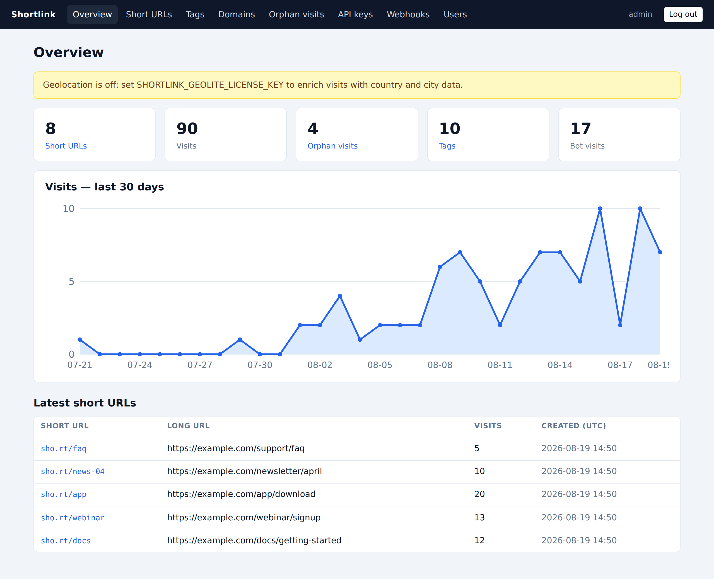
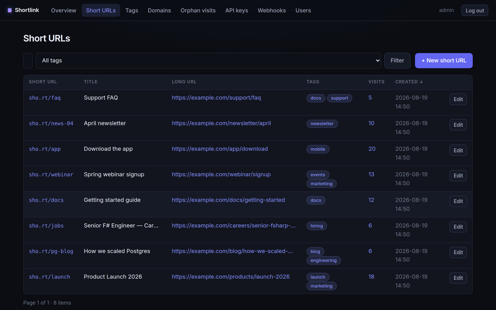
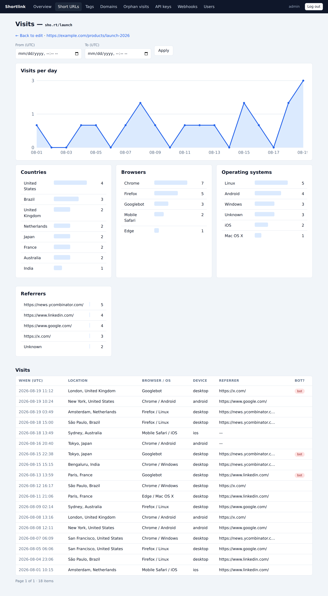
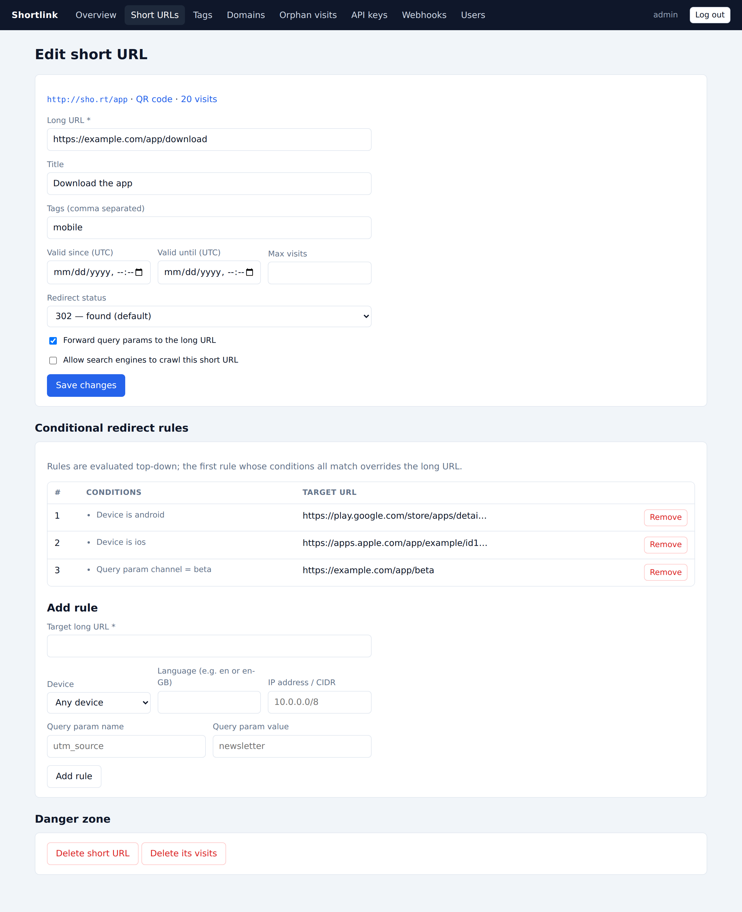

# Shortlink

A self-hosted URL shortener written in F#, built on [Falco](https://www.falcoframework.com/)
and [htmx](https://htmx.org/). Single binary, full REST API, server-rendered admin
dashboard, rich visit analytics.

**[📖 User documentation](https://olmesm.github.io/shortlink/)** · [Quick start](#quick-start) · [Configuration](#configuration) · [REST API](#rest-api)

## Screenshots

| Overview | Short URLs |
|---|---|
|  |  |

| Visit analytics | Redirect rules |
|---|---|
|  |  |

More in the [user documentation](https://olmesm.github.io/shortlink/).

## Features

- **Short URLs** — auto-generated codes (configurable length) or custom slugs
  (including path-style slugs like `docs/intro`), URL validation, automatic page
  title resolution, tags, per-URL redirect status (301/302/307/308), optional
  query-string forwarding.
- **Multi-domain** — serve many domains from one instance; short codes are unique
  per domain; unknown domains auto-register on first use; per-domain not-found
  redirects.
- **Lifetime controls** — `validSince`, `validUntil` and `maxVisits`; expired or
  exhausted links fall back to the configured not-found behavior.
- **Conditional redirect rules** — per-URL rules evaluated top-down that override
  the target by device (Android/iOS/mobile/desktop), `Accept-Language`, query
  parameter, or visitor IP/CIDR.
- **Visit analytics** — every redirect records referrer, user agent (parsed to
  browser/OS), device, bot detection, and IP-derived geolocation via MaxMind
  GeoLite2 (auto-downloaded and refreshed when a license key is configured).
  IPs are anonymized by default; IP capture and tracking as a whole can be
  disabled. Orphan visits (base URL hits, unknown short codes, other 404s) are
  tracked separately.
- **REST API** — everything is scriptable under `/rest/v1` with API keys
  (admin / author / domain-scoped roles), RFC 7807 problem responses,
  pagination, search, ordering and rate limiting.
- **Admin dashboard** — served at `/admin`; multi-user (admin/user roles),
  cookie sessions, htmx-driven live search and pagination, server-rendered SVG
  charts, QR previews, redirect-rule builder. No JS build step.
- **QR codes** — public `GET /{code}/qr-code` in PNG or SVG with size, margin
  and error-correction options.
- **Webhooks** — signed JSON POSTs (HMAC-SHA256) on `url.created`,
  `visit.recorded` and `orphan_visit.recorded`, delivered by a persistent queue
  with exponential-backoff retries.
- **robots.txt** — generated from per-URL `crawlable` flags.
- **SQLite or PostgreSQL** — SQLite by default (zero config), PostgreSQL for
  bigger installs. Schema migrates automatically on startup.

## Quick start

### Docker

```sh
docker compose up --build
```

Then open <http://localhost:8080/admin>. On first start an `admin` user is
created; its password comes from `SHORTLINK_INITIAL_ADMIN_PASSWORD`, or is
generated and printed in the container log.

For PostgreSQL:

```sh
docker compose --profile postgres up --build
```

and un-comment the `SHORTLINK_DB_*` variables in `docker-compose.yml`.

### From source

Requires the .NET 8 SDK.

```sh
dotnet run --project src/Shortlink.Web
```

Run the test suite (88 unit + integration tests):

```sh
dotnet test
```

Run the browser end-to-end tests (Playwright driving the real dashboard in
Chromium — 22 tests covering login, short URL lifecycle, htmx live search,
redirect rules, analytics, tags, domains, API keys, webhooks, users and
orphan visits; requires Node.js and the .NET SDK):

```sh
cd e2e
npm install
npx playwright install chromium   # once; or set PLAYWRIGHT_CHROMIUM_PATH to an existing binary
npm test
```

The e2e config starts the app itself on port 18100 with a throw-away SQLite
database, so no setup is needed.

## Configuration

Everything is configured through environment variables.

| Variable | Default | Purpose |
|---|---|---|
| `SHORTLINK_PORT` | `8080` | HTTP listen port |
| `SHORTLINK_DEFAULT_DOMAIN` | `localhost:<port>` | Authority used to build short URLs when no domain is given |
| `SHORTLINK_USE_HTTPS` | `false` | Render short URLs with `https://` |
| `SHORTLINK_DATA_DIR` | `./data` | SQLite db, GeoLite2 db, cookie keys |
| `SHORTLINK_DB_DRIVER` | `sqlite` | `sqlite` or `postgres` |
| `SHORTLINK_DB_CONNECTION` | SQLite in data dir | Full connection string |
| `SHORTLINK_SHORT_CODE_LENGTH` | `5` | Length of generated codes (min 4) |
| `SHORTLINK_REDIRECT_STATUS` | `302` | Default redirect status (301/302/307/308) |
| `SHORTLINK_AUTO_RESOLVE_TITLES` | `true` | Fetch page `<title>` in the background |
| `SHORTLINK_DISABLE_TRACKING` | `false` | Record no visits at all |
| `SHORTLINK_DISABLE_IP_TRACKING` | `false` | Track visits but never record IPs |
| `SHORTLINK_ANONYMIZE_IPS` | `true` | Zero the host bits of recorded IPs |
| `SHORTLINK_TRACK_SKIP_PARAM` | *(unset)* | Query param that opts a request out of tracking (e.g. `no-track`) |
| `SHORTLINK_TRACK_ORPHAN_VISITS` | `true` | Track base-URL/404 traffic |
| `SHORTLINK_BASE_URL_REDIRECT` | *(unset)* | Where `GET /` redirects (else a landing page) |
| `SHORTLINK_REGULAR_404_REDIRECT` | *(unset)* | Redirect for non-short-URL 404s |
| `SHORTLINK_INVALID_SHORT_URL_REDIRECT` | *(unset)* | Redirect for unknown/expired short codes |
| `SHORTLINK_GEOLITE_LICENSE_KEY` | *(unset)* | Enables GeoLite2 download + visit geolocation |
| `SHORTLINK_INITIAL_ADMIN_USERNAME` | `admin` | First-run dashboard admin |
| `SHORTLINK_INITIAL_ADMIN_PASSWORD` | *(generated)* | First-run admin password |
| `SHORTLINK_RATE_LIMIT_PER_MINUTE` | `120` | Mutating REST calls per minute per IP (0 disables) |

Per-domain not-found redirects (configured in the dashboard or via
`PATCH /rest/v1/domains/redirects`) take precedence over the global ones.

Behind a reverse proxy, `X-Forwarded-For` / `X-Forwarded-Proto` are honored.

## REST API

Authenticate with `X-Api-Key: <key>` (or `Authorization: Bearer <key>`).
Keys are created in the dashboard (*API keys*) or via the API itself, and are
shown exactly once. Roles:

- **admin** — full access.
- **author** — sees and manages only the short URLs created with that key.
- **domain** — restricted to one domain.

Errors are `application/problem+json` (RFC 7807). List endpoints support
`page` and `itemsPerPage` and return a `pagination` envelope.

### Short URLs

| Method & path | Notes |
|---|---|
| `GET /rest/v1/short-urls` | `searchTerm`, `tags`, `tagsMode=any\|all`, `startDate`, `endDate`, `domain`, `orderBy=dateCreated\|shortCode\|longUrl\|title\|visits` + `-ASC/-DESC`, `excludeMaxVisitsReached`, `excludePastValidUntil` |
| `POST /rest/v1/short-urls` | body: `longUrl` (required), `customSlug`, `shortCodeLength`, `domain`, `title`, `tags`, `maxVisits`, `validSince`, `validUntil`, `forwardQuery`, `crawlable`, `redirectStatus`, `findIfExists` |
| `GET /rest/v1/short-urls/{code}` | optional `?domain=` on all `{code}` routes |
| `PATCH /rest/v1/short-urls/{code}` | partial update; send `null` to clear `title`, `maxVisits`, `validSince`, `validUntil` |
| `DELETE /rest/v1/short-urls/{code}` | |
| `GET/POST /rest/v1/short-urls/{code}/redirect-rules` | POST replaces all rules; conditions: `device`, `language`, `query-param`, `ip-address` |
| `GET /rest/v1/short-urls/{code}/visits` | `startDate`, `endDate`, `excludeBots` |
| `DELETE /rest/v1/short-urls/{code}/visits` | |

Example:

```sh
curl -H "X-Api-Key: $KEY" -H "Content-Type: application/json" \
  -d '{"longUrl":"https://example.com/landing","customSlug":"promo","tags":["marketing"]}' \
  http://localhost:8080/rest/v1/short-urls
```

### Tags, domains, visits, stats

| Method & path | Notes |
|---|---|
| `GET /rest/v1/tags` | `withStats=true`, `searchTerm` |
| `PUT /rest/v1/tags` | `{"oldName":"a","newName":"b"}` |
| `DELETE /rest/v1/tags?tags=a,b` | |
| `GET /rest/v1/tags/{tag}/visits` | |
| `GET /rest/v1/domains` | |
| `POST /rest/v1/domains` | admin; `{"domain":"links.example.com"}` |
| `PATCH /rest/v1/domains/redirects` | admin; per-domain not-found redirects |
| `DELETE /rest/v1/domains/{authority}` | admin; default domain is protected |
| `GET /rest/v1/domains/{authority}/visits` | |
| `GET /rest/v1/visits` | admin; global counters |
| `GET /rest/v1/visits/non-orphan` · `GET/DELETE /rest/v1/visits/orphan` | admin |
| `GET /rest/v1/stats/visits-per-day` | scope with `shortCode`, `tag`, `domain` or `orphan=true`; `startDate`/`endDate` |
| `GET /rest/v1/stats/breakdown?by=country\|city\|browser\|os\|referer\|device` | same scoping |

### API keys & webhooks (admin)

| Method & path | Notes |
|---|---|
| `GET/POST /rest/v1/api-keys` | create returns `apiKey` once; body: `name`, `role`, `domain`, `expiresAt` |
| `PATCH /rest/v1/api-keys/{id}` | `{"enabled":false}` |
| `DELETE /rest/v1/api-keys/{id}` | |
| `GET/POST /rest/v1/webhooks` | create returns the signing `secret` once |
| `PATCH /rest/v1/webhooks/{id}` · `DELETE /rest/v1/webhooks/{id}` | |

Webhook deliveries are JSON:
`{"event":"visit.recorded","occurredAt":"…","data":{…}}` with an
`X-Shortlink-Event` header and an `X-Shortlink-Signature: sha256=<hex>` header —
the HMAC-SHA256 of the raw body with the webhook secret. Failed deliveries are
retried with exponential backoff (up to 6 attempts) and survive restarts.

### Misc

- `GET /rest/health` — unauthenticated health check.
- `GET /{code}/qr-code?size=300&format=png|svg&margin=1&errorCorrection=L|M|Q|H`
- `GET /robots.txt`

## Architecture

```
src/
  Shortlink.Core/   pure domain: constrained types (LongUrl, ShortCode,
                    TagName, DomainAuthority, typed ids), the ShortUrlSpec /
                    ShortUrlEdit smart constructors, Lifetime invariants,
                    redirect rule engine, IP anonymization
  Shortlink.Data/   Dapper repositories with dialect-aware SQL
                    (SQLite + PostgreSQL), forward-only migrations,
                    transactional writes for multi-step operations
  Shortlink.Web/    Falco app: redirect hot path, REST API, htmx dashboard,
                    typed domain events, background workers (event fan-out,
                    geolocation, GeoLite2 refresh, title resolution,
                    webhook delivery)
tests/
  Shortlink.Tests/  xUnit: unit tests + full-stack integration tests on
                    an in-memory TestServer
e2e/                Playwright browser tests driving the dashboard
```

The design follows the functional-core / imperative-shell style with
domain modeling in the Wlaschin ("Domain Modeling Made Functional") vein:

- **Parse, don't validate.** Raw input (JSON bodies, form fields, env vars)
  is parsed once into constrained types — `LongUrl`, `ShortCode`, `TagName`,
  `DomainAuthority` — whose constructors are private, so an unvalidated
  value cannot reach a repository.
- **One home per invariant.** `ShortUrlSpec.create` / `ShortUrlEdit.create`
  enforce every creation/edit rule (`maxVisits > 0`,
  `validSince < validUntil`, valid status codes, tag rules); the REST API
  and the dashboard both go through them, so the entry points cannot drift.
- **Typed everything at boundaries.** `ShortUrlId`/`DomainId`/… prevent id
  transposition; API-key roles parse fail-closed (an unknown stored role is
  an invalid key, never a default admin); repository errors are DUs, not
  strings to grep.
- **Errors as values.** `Result` + FsToolkit's `result`/`taskResult`
  computation expressions end-to-end; exceptions only at the persistence
  edge, translated immediately (e.g. duplicate key → `SlugInUse`).
- **Atomic writes.** A short URL and its tag links are inserted in one
  transaction; rules and tag replacements likewise.
- **Events off the hot path.** The redirect path does one indexed lookup,
  evaluates rules in memory, records the raw visit, and answers; typed
  `DomainEvent`s go onto a channel, and workers handle geolocation, webhook
  fan-out and delivery.

Notes:

- Sessions use SameSite=Lax cookies; dashboard mutations are POST-only, which
  blocks cross-site request forgery for the session cookie.
- Passwords are bcrypt-hashed; API keys and webhook secrets are stored hashed
  or server-side only and shown exactly once.
- All timestamps are UTC.
